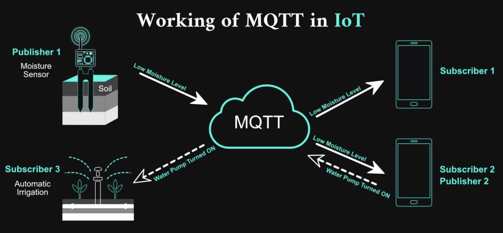

# micrOS Application: async\_mqtt



Async MQTT client for micrOS devices. It connects to a broker, subscribes to device topics, runs micrOS commands from incoming messages, and publishes JSON responses.

## Install

```bash
pacman install "github:BxNxM/micrOSPackages/async_mqtt"
```

```bash
pacman upgrade "async_mqtt"
pacman uninstall "async_mqtt"
```

## Device Layout

- Package files: `/lib/async_mqtt`
- Load module: `/modules/LM_mqtt_client.py`

## Usage

```commandline
mqtt_client load username:str password:str server_ip:str server_port:str='1883' qos:int=1
mqtt_client publish topic:str message:str retain=False
```

[documentation](https://htmlpreview.github.io/?https://github.com/BxNxM/micrOS/blob/master/micrOS/client/sfuncman/sfuncman.html#mqtt_client)

## Dependency

Dependencies are auto installed by `mip` based on `package.json`

```text
github:peterhinch/micropython-mqtt
```

## Author

Flórián Mandl ([@fmandl](https://github.com/fmandl))
